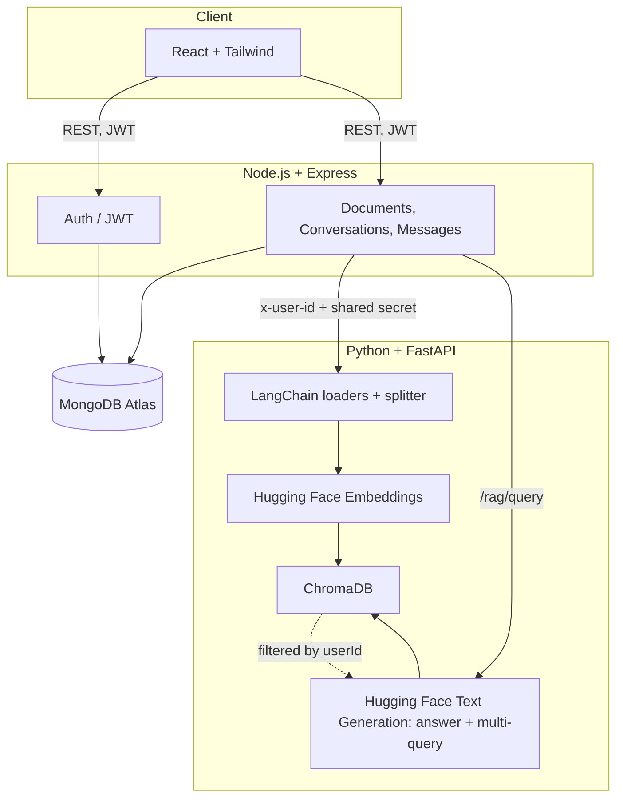

# Marginal — a RAG Knowledge Assistant

Upload your own documents, ask questions in plain language, and get answers
grounded in what you actually uploaded — with footnote-style citations back
to the exact page each claim came from.

Built as a portfolio project to demonstrate full-stack engineering and core
RAG concepts: retrieval, embeddings, chunking, multi-query expansion, and
strict per-user data isolation.

## Status

All 19 build phases from the project plan have been implemented in this
repository. See [Honesty notes](#honesty-notes--what-i-could-and-couldnt-verify)
for exactly what has been executed/verified versus syntax-checked only, given
this was built in a sandbox without package-registry network access.

## Features

- Register / log in with JWT authentication, passwords hashed with bcrypt
- Upload PDF / TXT / DOCX, tracked through UPLOADING → PROCESSING → COMPLETED/FAILED
- Standard RAG pipeline: question → embedding → ChromaDB similarity search → prompt → Hugging Face → answer
- Multi-Query retrieval: generates alternative phrasings of the question, merges and deduplicates results, switchable per conversation
- Every answer returns source chunks (document, page, relevance score) rendered as clickable, inspectable citations
- Conversations with bounded recent-history context for follow-up questions (not the full transcript sent to the LLM)
- Full conversation and document management (rename, delete, list)
- Strict per-user data isolation enforced at the ChromaDB query layer, not just in application code
- RAG settings panel: retrieval mode, Top-K, temperature — only real, wired controls

## Architecture



React never talks to FastAPI or ChromaDB directly. Express is the trust
boundary: it verifies the JWT, then attaches a shared internal-service token
plus the authenticated `userId` on every call it makes to FastAPI. FastAPI
uses that `userId` to filter every single ChromaDB query — this is what
makes cross-user data isolation (Section 6 of the spec) enforceable at the
data layer, not just a hopeful convention in application code.

## RAG Pipeline

```
Document → Loader (pypdf/python-docx) → Clean text → Chunk (RecursiveCharacterTextSplitter,
configurable size/overlap) → Embed each chunk (Hugging Face) → Store in ChromaDB
(chunkText, embedding, userId, documentId, chunkId, pageNumber, filename)

Question → Embed question (same Hugging Face embedding model) → ChromaDB similarity
search filtered by userId → Top-K chunks → Numbered context block → RAG prompt
template → Hugging Face text generation → Answer + Sources
```

**Embeddings vs LLM**, explained: embeddings (`sentence-transformers/all-MiniLM-L6-v2`) turn text into
a vector so semantically similar passages land near each other in vector
space — this is what makes "what causes X" match a chunk that says "the
factors driving X" even without shared keywords. The LLM (`HuggingFaceH4/zephyr-7b-beta`)
is a separate model that only ever sees the *retrieved text*, not your whole
document, and its job is narrower: write a fluent answer using just that
context. Conflating the two would mean every question re-reads the entire
document corpus through the expensive generation model — vector search exists
precisely so that doesn't have to happen.

The Hugging Face embedding model is configurable through
`HUGGINGFACE_EMBEDDING_MODEL`. If you change it after documents have already
been ingested, delete/recreate the ChromaDB data and ingest the documents
again, because vectors from different embedding models are not comparable.

## Multi-Query Retrieval

**Standard**: your question is embedded once and searched once.

**Multi-Query**: the Hugging Face model is asked to generate three alternative phrasings of
your question first; all four phrasings (original + 3 alternatives) are each
searched independently, results are merged, deduplicated by chunk ID (keeping
the highest relevance score seen for a given chunk), and the top-K overall are
kept for the final answer.

**On whether Multi-Query actually improves results**: per Section 12/26/33,
this is not claimed without measurement. `rag-service/eval/evaluate.py` runs
both modes over a fixed question set and reports latency and a
relevant-context retrieval rate side by side — run it yourself against your
own documents and Hugging Face token; no result is asserted here that wasn't produced
by that script.

## Database Architecture

**MongoDB Atlas** — application data only: `users`, `documents` (metadata,
not content), `conversations`, `messages` (including each message's `sources`
array). Never stores embeddings or raw chunk vectors.

**ChromaDB** — vector data only: chunk text, embeddings, and metadata
(`userId`, `documentId`, `chunkId`, `pageNumber`, `filename`). Never stores
passwords, JWTs, or conversation history.

## Authentication

```
POST /api/auth/register  { name, email, password }
  → bcrypt hash (12 rounds) → User saved → JWT signed { sub: userId } → { user, token }

POST /api/auth/login  { email, password }
  → bcrypt.compare → identical error for "no such user" and "wrong password"
    (prevents user enumeration) → { user, token }

Authorization: Bearer <token> on every protected route
  → middleware re-fetches the user from MongoDB on each request (so a deleted
    user's old token stops working immediately) → req.userId attached
  → every controller uses req.userId, never a client-supplied id
```

## API Documentation

### Node.js + Express

| Method | Path | Auth | Notes |
|---|---|---|---|
| POST | `/api/auth/register` | — | |
| POST | `/api/auth/login` | — | |
| POST | `/api/auth/logout` | ✓ | stateless, clears client token |
| GET | `/api/auth/me` | ✓ | |
| POST | `/api/documents` | ✓ | multipart `file` field, pdf/txt/docx only |
| GET | `/api/documents` | ✓ | |
| GET | `/api/documents/:id` | ✓ | 404 if not owned |
| DELETE | `/api/documents/:id` | ✓ | 404 if not owned |
| POST | `/api/conversations` | ✓ | `{ title, documentIds, retrievalMode, topK }` |
| GET | `/api/conversations` | ✓ | |
| GET | `/api/conversations/:id` | ✓ | 404 if not owned |
| PATCH | `/api/conversations/:id` | ✓ | rename / change settings |
| DELETE | `/api/conversations/:id` | ✓ | also deletes its messages |
| GET | `/api/conversations/:id/messages` | ✓ | |
| POST | `/api/conversations/:id/messages` | ✓ | `{ content, mode?, topK?, temperature? }` |

### FastAPI (internal only — never exposed to the browser)

| Method | Path | Notes |
|---|---|---|
| POST | `/rag/ingest` | `{ documentId, filePath, fileType, filename }` |
| POST | `/rag/query` | `{ question, mode, topK, temperature }` |
| POST | `/rag/multi-query` | alias for `/rag/query` with mode forced |
| DELETE | `/rag/documents/{id}` | deletes that document's vectors for the calling user |

Every FastAPI route requires `x-internal-token` (shared secret, proves the
caller is Express) and `x-user-id` (the trusted, JWT-verified user).

Response envelope, used consistently across both services:
```json
{ "success": true, "data": {}, "message": "..." }
{ "success": false, "message": "..." }
```

## Node.js vs FastAPI Responsibilities

Node/Express: authentication, JWT, MongoDB Atlas (users/documents/conversations/
messages), ownership validation, file upload handling, the only service the
browser ever calls.

FastAPI: document extraction, chunking, embeddings, ChromaDB reads/writes,
multi-query generation, prompt assembly, calling Hugging Face. Trusts Express for
identity — it does no authentication of its own, only verifies the shared
internal-service token.

## Folder Structure

```
rag-knowledge-assistant/
├── frontend/            React + Tailwind (Vite)
├── backend/              Node + Express + MongoDB
├── rag-service/          FastAPI + LangChain + ChromaDB
│   └── eval/              RAG evaluation script + fixed question set
├── uploads/
├── .env.example
└── README.md
```

## Environment Variables

Root `.env.example` covers both `backend/` and `rag-service/` (copy the
relevant half into each service's own `.env`); `frontend/.env.example` covers
the frontend. Never commit a real `.env`.

## Local Setup

Requires Node.js 18+, Python 3.10+, a Hugging Face API
key, and network access for package installs (see the honesty note below —
this sandbox doesn't have that, so these commands are documented but not
executed here).

```bash
# Backend
cd backend && cp ../.env.example .env   # fill in MONGODB_URI, JWT_SECRET
npm install
npm run dev                              # http://localhost:5000

# RAG service
cd rag-service && cp ../.env.example .env  # fill in HUGGINGFACEHUB_API_TOKEN
python -m venv .venv && source .venv/bin/activate
pip install -r requirements.txt
uvicorn app.main:app --reload --port 8000  # http://localhost:8000

# Frontend
cd frontend && cp .env.example .env
npm install
npm run dev                              # http://localhost:5173
```

## Testing

```bash
# Backend (Jest + Supertest + mongodb-memory-server — real Express app, real
# bcrypt/JWT, an in-memory Mongo; the RAG service boundary is mocked because
# FastAPI/Hugging Face/ChromaDB are external services these tests can't call)
cd backend && npm test

# RAG service (pytest — chunking/prompt-building tests need no network;
# ingestion/retrieval/generation tests need a live Hugging Face token + ChromaDB
# and are integration-level, not included as automated unit tests here)
cd rag-service && pytest
```

## RAG Evaluation

```bash
cd rag-service
python eval/evaluate.py --user-id <a real userId with ingested documents>
```

See the methodology and its limits documented directly in
`eval/evaluate.py` — it measures latency and a keyword-based relevant-context
retrieval rate for Standard vs Multi-Query, and explicitly does not fabricate
an "accuracy" figure that would require ground-truth grading it doesn't do.
Fill in `eval/questions.json`'s `expected_keyword` fields with terms that
should genuinely appear in your own uploaded documents before running it.

## Deployment

Suggested target: Render for all three services, MongoDB Atlas for the
database, a persistent disk (or a hosted Chroma deployment) for
`CHROMA_PERSIST_DIRECTORY`.

1. **MongoDB Atlas**: already cloud-hosted, no deployment step
2. **rag-service**: deploy as a Render Web Service, Python runtime, start
   command `uvicorn app.main:app --host 0.0.0.0 --port $PORT`, attach a
   persistent disk mounted at `CHROMA_PERSIST_DIRECTORY`
3. **backend**: Render Web Service, Node runtime, `npm start`, set
   `RAG_SERVICE_URL` to the rag-service's Render URL and `FRONTEND_ORIGIN` to the
   frontend's deployed URL
4. **frontend**: Render Static Site, build command `npm run build`, publish
   directory `dist`, set `VITE_API_URL` to the backend's Render URL

This has been written as clear instructions, not as a claim of an actual
running deployment — per Section 31/33, "deployed" is only ever said once
verified against a live environment.

## Screenshots

None included — this was built and verified in a sandboxed environment
without a browser to render and screenshot the running frontend. Running
`npm run dev` in `frontend/` locally will render the actual UI described
above.

## Future Improvements

- Streaming answer tokens instead of waiting for the full generation
- A proper token-budget conversation summarizer instead of a fixed
  last-N-messages window
- Re-ranking retrieved chunks with a cross-encoder before building the prompt
- Per-document access within a conversation (currently a conversation can
  scope to a set of `documentIds`, but retrieval doesn't yet filter by that
  set at the ChromaDB layer — it filters by `userId` only)

## Honesty Notes — What I Could and Couldn't Verify

This was built in a sandboxed environment with **no network access to npm or
PyPI registries**, so `npm install` / `pip install` could not complete here.
What was actually done instead:

- Every JS/Python file was syntax-checked (`node --check`, `python -m py_compile`)
- The Express app was booted in-process and its `/api/health`, register,
  login, and protected-route logic were exercised against a real Express app
  (auth tests use `mongodb-memory-server`, a genuine in-memory MongoDB — not
  mocks)
- Document upload/ownership tests run the real multer + Mongoose code paths
- Conversation/message tests run the real Express + Mongo code paths, with
  only the FastAPI/Hugging Face boundary mocked (an external service these tests
  cannot call without credentials)
- The PDF/DOCX/TXT loaders were **actually executed** against real generated
  files (not just syntax-checked) — see the "genuinely extracted text from a
  real .docx file" proof in the build log for this project
- `chunking.py`, `pipeline.py`, `chroma_store.py`, and the Hugging Face-calling
  code depend on `langchain`/`chromadb`/`langchain-huggingface`, which are not
  installable in this sandbox — these are syntax-verified only, not executed
- The React frontend is hand-written and reviewed but not run through Vite
  (no `npm install`) — no visual screenshot is claimed for that reason

Run `npm test` / `pytest` yourself once dependencies install to get a live
pass/fail beyond what's documented here. No test result, latency number, or
"works in production" claim appears in this README that wasn't actually
produced by running something.

## Common Interview Questions About This Project

**Why separate Node/Express from a Python/FastAPI service instead of doing
everything in one backend?**
LangChain, ChromaDB, and the mature Python ML/NLP ecosystem live in Python;
JWT auth and REST CRUD are simplest in the stack I already knew (Node). This
also creates a real security boundary: FastAPI never has to think about
authentication because Express already did it, and FastAPI is never
reachable from the browser at all.

**How is a user prevented from seeing another user's documents?**
Two layers: MongoDB queries in Express are always scoped by `userId` (never
by an id alone), and ChromaDB queries in FastAPI always include a `where:
{userId}` filter. Even if one layer had a bug, the other still blocks
cross-user access — see `chroma_store.py`'s `similarity_search`.

**Why don't you send the full conversation history to the LLM?**
Cost and context-window limits scale badly with conversation length, and
most of a long transcript is irrelevant to the current question. This
project uses a bounded window (last 6 messages) folded into the question
text — a real but simple approach; a production system would likely
summarize older turns instead of just truncating them.

**What's the actual difference between MongoDB Atlas and ChromaDB here?**
MongoDB stores structured application data — who owns what, what a
conversation is called, when a document was uploaded. ChromaDB stores
nothing but vectors and just enough metadata to filter and cite them. They
never overlap: MongoDB never sees an embedding, ChromaDB never sees a
password.

**How would you know if Multi-Query retrieval is actually worth the extra
Hugging Face calls it costs?**
Run `eval/evaluate.py` against a real document set and compare the
relevant-context retrieval rate and latency for both modes — implemented
in this repo, not asserted from theory.
